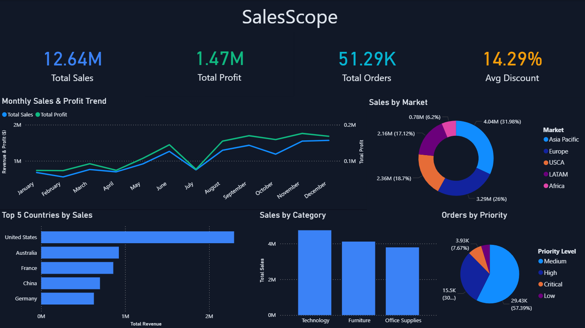
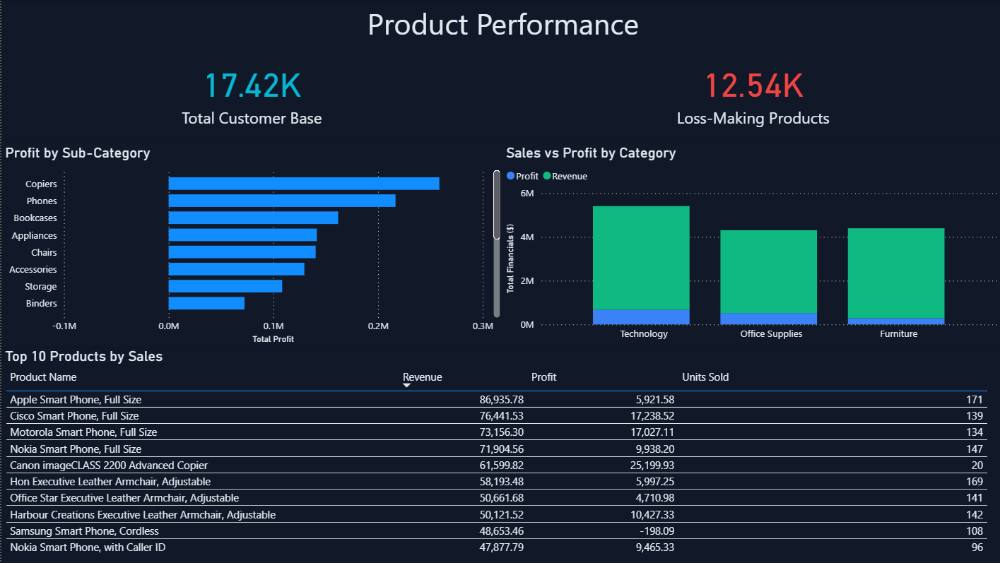
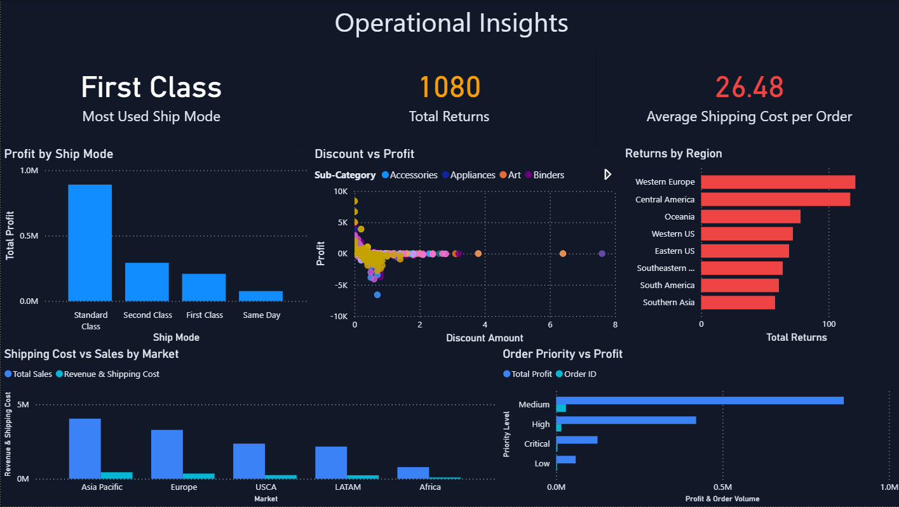

# SalesScope – Global Sales & Operational Intelligence

A 3-page business intelligence dashboard built in Power BI, 
designed to track global sales performance, identify 
profit-bleeding products, and surface operational inefficiencies 
across markets and shipping modes.

---

## Dashboard Preview

---

## Project Objective

Built for business stakeholders who need a clear, visual answer 
to three core questions:
- Where is revenue coming from?
- Which products are hurting profitability?
- Where are operational costs and returns concentrated?

---

## Dashboard Structure

| Page | Title | Focus |
|------|-------|-------|
| 1 | Executive Overview | KPIs, trends, market share |
| 2 | Product Performance | Sub-category profit, top products, loss-makers |
| 3 | Operational Insights | Shipping, discounts, returns by region |

---

## Key Business Insights

**Profit Leakage:** The Tables sub-category is the primary driver 
of negative margins — generating consistent losses despite high 
order volume, indicating unsustainable discounting behavior.

**Return Concentration:** Western Europe records the highest 
return volume across all regions, signaling a need for shipping 
reliability or product quality audits in that territory.

**Discount Risk:** High-discount orders consistently fall into 
negative margin territory regardless of shipping mode — discount 
policy represents a larger profitability risk than shipping cost.

---

## Technical Highlights

**Data Modeling:** Resolved a relationship issue between the 
Orders and Returns tables by implementing bi-directional 
cross-filtering, enabling accurate regional return analysis.

**Dark Theme UI:** Designed a high-contrast dark mode layout to 
improve readability of financial KPIs and create a 
professional, enterprise-grade visual identity.

**Color System:** Applied a consistent semantic color language 
across all pages — blue for revenue, green for profit, red for 
losses and returns, orange for cost/warning metrics.

---

## Tools Used

- Power BI Desktop
- Microsoft Excel (Data Source)

---

## Data Source

Global Superstore 2016 Dataset  
51,290 orders across 3 tables: Orders, Returns, People  
Markets: Asia Pacific, Europe, USCA, LATAM, Africa

---

## Repository Structure

project/
├── data/
│   └── global_superstore_2016.xlsx
├── dashboard/
│   ├── SalesScope.pbix
│   └── screenshots/
│       ├── page1.png
│       ├── page2.png
│       └── page3.png
└── README.md